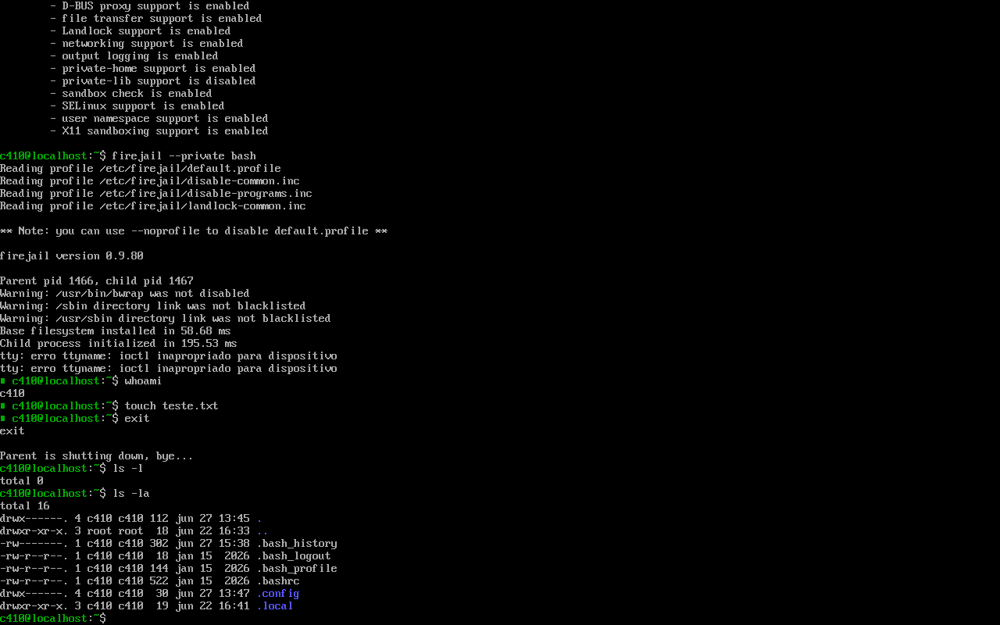
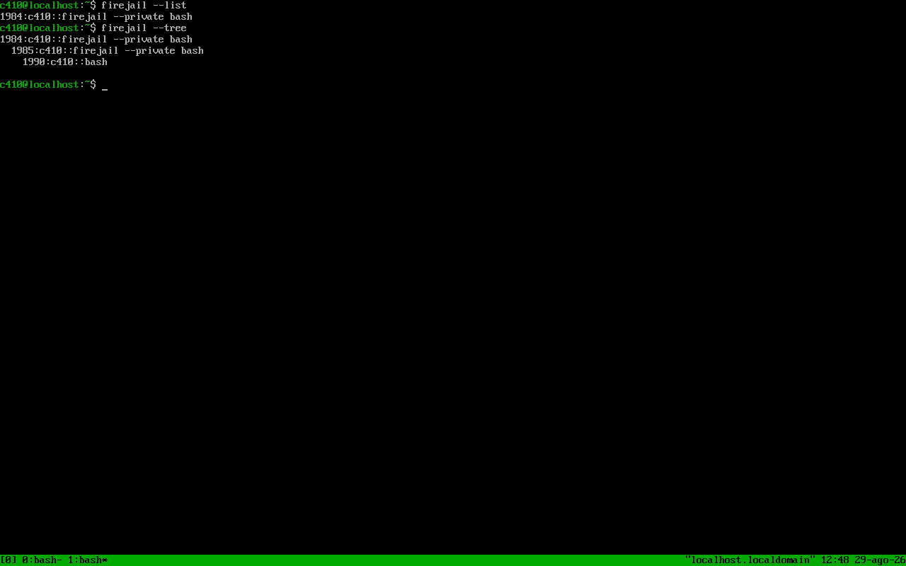
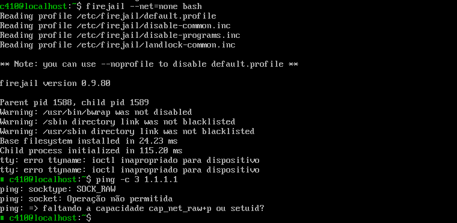

# Análise de Ferramenta Defensiva: Firejail

## 1. Resumo

O Firejail é uma ferramenta de sandboxing para sistemas Linux que permite executar aplicações e processos em ambientes restritos. Seu objetivo é reduzir o impacto de uma aplicação comprometida ou potencialmente não confiável, limitando seu acesso a recursos do sistema.

A ferramenta utiliza mecanismos nativos do Linux, incluindo namespaces, seccomp-BPF e Linux capabilities, além de oferecer suporte a perfis de segurança específicos para aplicações.

Neste laboratório, o objetivo é analisar como o Firejail pode ser utilizado como um controle de segurança para isolamento e contenção de processos, validando na prática suas principais funcionalidades.

## 2. Visão Geral da Ferramenta

O Firejail é um sandbox para Linux desenvolvido para restringir o ambiente de execução de aplicações.

A ferramenta cria uma visão isolada de determinados recursos do sistema para o processo e seus processos descendentes. Entre os recursos que podem ser isolados estão:

Filesystem;
Processos;
Network stack;
Mount points;
IPC;
Capabilities;
System calls.

O Firejail pode ser utilizado tanto para aplicações gráficas quanto para processos e serviços executados em servidores, além de possuir perfis específicos para diversas aplicações.

## 3. Objetivo de Segurança

O principal objetivo do Firejail é reduzir a superfície de impacto de processos potencialmente comprometidos. Dessa forma, caso uma aplicação apresente uma vulnerabilidade ou seja comprometida, o objetivo é reduzir os recursos que o processo pode acessar.

É importante destacar que o Firejail deve ser considerado uma camada de defesa, e não uma garantia de que um processo comprometido não conseguirá escapar do sandbox.

## 4. Instalação e Configuração

Sistema operacional: Debian GNU/Linux
Arquitetura: x86_64
Firejail: [0.9.80]
Kernel: [6.12 LTS]

Em sistemas Debian, como o utilizado no laboratório. basta rodar "sudo dnf install firejail"

## 5. Uso da Ferramenta

Um processo pode ser executado através do Firejail simplesmente utilizando:

firejail bash

O Firejail cria um ambiente restrito para o shell e seus processos descendentes.

  

  <em><strong>Figura 1.</strong>Teste de console isolado, evidenciado pelo arquivo criado, que não existe fora da sandbox</em>

Para visualizar os sandboxes ativos:

firejail --list

Para visualizar a árvore de processos:

firejail --tree

  

  <em><strong>Figura 1.</strong>Monitoramento de sandbox ativos e seus respectivos processos</em>

Esses comandos também são úteis durante uma investigação ou validação do ambiente.

O Firejail também permite criar um ambiente sem acesso à rede através de:

firejail --net=none bash

Esse tipo de configuração pode ser interessante para processos que não precisam de acesso à rede.

  

  <em><strong>Figura 1.</strong>Teste de rede em console isolado</em>

O Firejail utiliza arquivos de perfil para definir configurações específicas de segurança para aplicações.

Os perfis normalmente ficam em:

/etc/firejail/

Podemos verificar os perfis disponíveis:

ls /etc/firejail/

Um perfil pode definir diferentes controles, incluindo:

Blacklists;
Whitelists;
Seccomp;
Capabilities;
Network restrictions;
Filesystem restrictions;
Private directories;
Device restrictions.

A documentação oficial descreve os perfis como uma forma de definir conjuntos de permissões específicos para determinadas aplicações.

## 6. Referências
- [Documentação oficial do Firejail](https://firejail.wordpress.com/)
- [Github do Firejail](https://github.com/netblue30/firejail/tree/master) 

